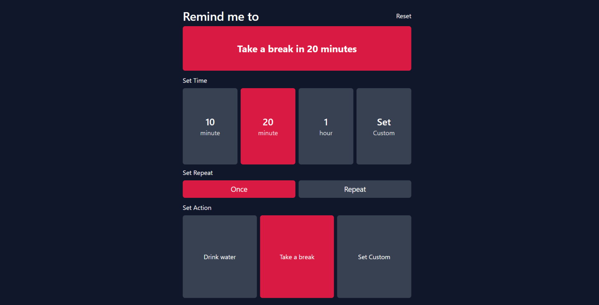

# Remind Me - React App


This is a simple reminder app that I made using ReactJS and Tailwind for practice. Check this project on vercel through [here](https://remind-me-ten.vercel.app/).


## Getting started
#### 1. Access directory
```
cd remind-me
```
#### 2. Install packages
```
npm install --save --force
```
#### 3. Start app
```
npm start
```
